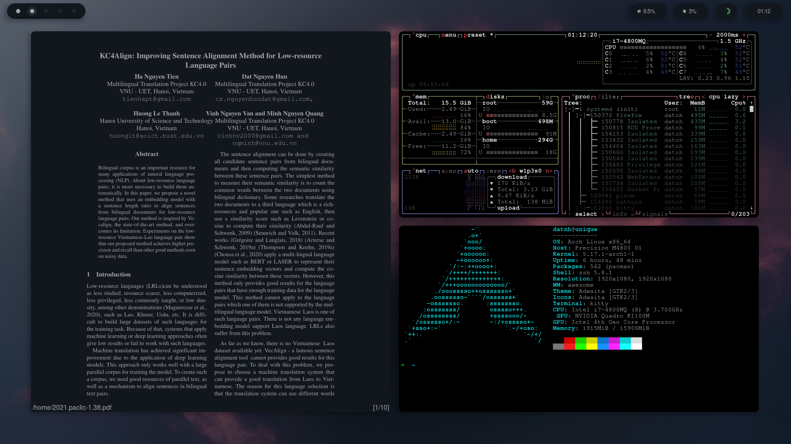

## awesome

	

### Welcome!

This are my personal configurations of AwesomeWM compiled and tailored for myself from various sources.

AwesomeWM is the most powerful and highly configurable, next generation framework window manager for X, Although it takes time and effort to configure it, but I'm very satisfied with the result.

## Information
**Some details about my config**

Task | Name
-------- | -----------
OS | `Arch linux`
WM | `Awesome`
Terminal | `Kitty`
Shell | `Zsh`
**another modules**
* `Nvim`: Editor
* `Picom`: Compositor
* `Rofi`: Application Launcher
* `Zathura`: Read Pdf
* `Bling`: Layouts for window management
* `rubato`: Creates Smooth Animations

